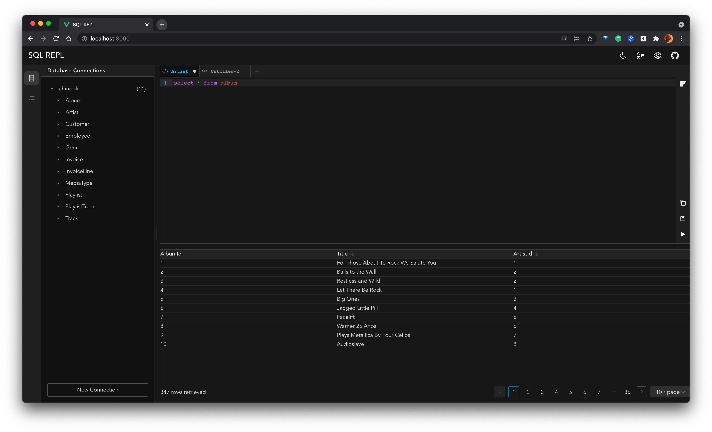

# SQL REPL

Just a SQL REPL Tools for web.

## 🖼️ Preview



## ✨ Features

* 🔍 SQL query editor with syntax highlighting
* ↕️ SQL query editor with Split Panes，so you could resize it as you wish
* 🗒️ Table View with sorter
* 🌛 Darkmode support
* 🌍 i18n support

SQL REPL now support connecting to the following databases:

* SQLite
* MySQL (WIP)

## 💻 Tech Stack

### Server

* better-sqlite3
* dayjs
* koa
  * koa-body
  * koa-bodyparser
  * koa-router
  * kcors
* log4js

### Client

* codemirror@next
* Vue 3
* Vite
* pinia
* naive-ui
* splitpanes
* windicss
* vueuse
* dayjs
* keymaster

## 📖 Usage

### Install

> I perferred to use `pnpm` instead `yarn` or `npm`.

Install both [client](./client/package.json) & [server](./server/package.json) dependencies with one script:

```bash
pnpm install
```

### Serve the APP

```bash
pnpm start
```

It will be running at: [http://localhost:3000/](http://localhost:3000/)

## 📄 License

MIT [@xiaoluoboding](https://github.com/xiaoluoboding)
